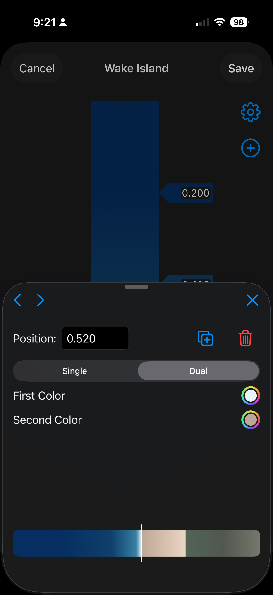

# GradientEditor

A SwiftUI package for editing color gradients with an intuitive, gesture-driven interface.


## Screenshots

<p align="center">
  
  
  
</p>

## Features

- ✨ **Interactive Gradient Editing** - Drag color stops, adjust positions, modify colors
- 🎨 **Single & Dual-Color Stops** - Create smooth gradients or hard color transitions
- 🔍 **Zoom & Pan** - Zoom up to 4x for precise stop positioning
- 📱 **Adaptive Layout** - Automatic adaptation to device size and orientation
- ♿️ **Fully Accessible** - Complete VoiceOver and Dynamic Type support
- 🌐 **Localized** - Ready for internationalization with string catalog
- 🧪 **Thoroughly Tested** - 163 tests with 100% pass rate
- 🎯 **Swift 6 Strict Concurrency** - Thread-safe with `@MainActor` isolation

## Quick Start

### Installation

Add GradientEditor to your project using Swift Package Manager:

```swift
dependencies: [
    .package(url: "https://github.com/JoshuaSullivan/GradientEditor.git", from: "1.3.0")
]
```

### Basic Usage

```swift
import SwiftUI
import GradientEditor

struct ContentView: View {
    @State private var viewModel: GradientEditViewModel

    init() {
        // Create view model with a preset gradient
        viewModel = GradientEditViewModel(scheme: .wakeIsland) { result in
            switch result {
            case .saved(let scheme):
                print("Gradient '\(scheme.name)' saved with \(scheme.colorMap.stops.count) stops")
                // Save the gradient scheme to your app's storage
            case .cancelled:
                print("Editing cancelled")
            }
        }
    }

    var body: some View {
        GradientEditView(viewModel: viewModel)
    }
}
```

### UIKit Usage (iOS/visionOS)

For UIKit-based apps, use `GradientEditorViewController`:

```swift
import UIKit
import GradientEditor

class MyViewController: UIViewController {
    func presentGradientEditor() {
        let editor = GradientEditorViewController(scheme: .wakeIsland) { result in
            switch result {
            case .saved(let scheme):
                self.saveGradient(scheme)
            case .cancelled:
                print("User cancelled")
            }
            self.dismiss(animated: true)
        }

        // Present modally with navigation controller
        let nav = UINavigationController(rootViewController: editor)
        present(nav, animated: true)
    }
}
```

**Delegate Pattern:**
```swift
class MyViewController: UIViewController, GradientEditorDelegate {
    func presentGradientEditor() {
        let editor = GradientEditorViewController(scheme: .wakeIsland)
        editor.delegate = self

        let nav = UINavigationController(rootViewController: editor)
        present(nav, animated: true)
    }

    func gradientEditor(_ editor: GradientEditorViewController, didSaveScheme scheme: GradientColorScheme) {
        saveGradient(scheme)
        dismiss(animated: true)
    }

    func gradientEditorDidCancel(_ editor: GradientEditorViewController) {
        dismiss(animated: true)
    }
}
```

### AppKit Usage (macOS)

For AppKit-based Mac apps, use the AppKit `GradientEditorViewController`:

```swift
import AppKit
import GradientEditor

class MyViewController: NSViewController {
    func presentGradientEditor() {
        let editor = GradientEditorViewController(scheme: .wakeIsland) { result in
            switch result {
            case .saved(let scheme):
                self.saveGradient(scheme)
            case .cancelled:
                print("User cancelled")
            }
            self.dismiss(editor)
        }

        // Present as sheet
        presentAsSheet(editor)
    }
}
```

**Delegate Pattern:**
```swift
class MyViewController: NSViewController, GradientEditorDelegate {
    func presentGradientEditor() {
        let editor = GradientEditorViewController(scheme: .wakeIsland)
        editor.delegate = self
        presentAsSheet(editor)
    }

    func gradientEditor(_ editor: GradientEditorViewController, didSaveScheme scheme: GradientColorScheme) {
        saveGradient(scheme)
        dismiss(editor)
    }

    func gradientEditorDidCancel(_ editor: GradientEditorViewController) {
        dismiss(editor)
    }
}
```

## Key Components

### GradientEditView

The main SwiftUI view for gradient editing. Provides:
- Interactive gradient preview with draggable color stops
- Zoom (1x-4x) and pan gestures for precise editing
- Adaptive layout for compact and regular size classes
- Built-in controls for adding and editing color stops

### GradientEditViewModel

The view model managing gradient editing state:
- Color stop management (add, delete, duplicate, modify)
- Zoom and pan state
- Selection and editing state
- Completion callbacks for save/cancel

### Data Models

- **`GradientColorScheme`** - A named gradient with metadata
- **`ColorMap`** - Collection of color stops defining a gradient
- **`ColorStop`** - Single color or dual-color at a position (0.0-1.0)
- **`ColorStopType`** - `.single(CGColor)` or `.dual(CGColor, CGColor)`

## Example: Custom Gradient

```swift
// Create a custom gradient
let customGradient = GradientColorScheme(
    name: "Ocean Depths",
    description: "Deep blues fading to black",
    colorMap: ColorMap(stops: [
        ColorStop(position: 0.0, type: .single(.blue)),
        ColorStop(position: 0.7, type: .dual(.cyan, .black)),
        ColorStop(position: 1.0, type: .single(.black))
    ])
)

// Use it in the editor
let viewModel = GradientEditViewModel(scheme: customGradient) { result in
    // Handle result
}
```

## Built-in Presets

GradientEditor includes several preset gradients:

- **Black & White** - Simple two-color gradient
- **Wake Island** - Tropical island colors
- **Neon Ripples** - Abstract neon lines
- **Apple ][ River** - Retro computing green
- **Electoral Map** - Red vs. blue
- **Topographic** - Map-inspired contours

Access all presets: `GradientColorScheme.allPresets`

## Using Gradients in Your App

After editing a gradient, you can easily convert it to platform-specific gradient types:

### SwiftUI Gradients

```swift
case .saved(let scheme):
    // Linear gradient (horizontal by default)
    let linear = scheme.linearGradient()
    Rectangle().fill(linear)

    // Vertical gradient
    let vertical = scheme.linearGradient(startPoint: .top, endPoint: .bottom)
    Rectangle().fill(vertical)

    // Radial gradient
    let radial = scheme.radialGradient(
        center: .center,
        startRadius: 0,
        endRadius: 200
    )
    Circle().fill(radial)

    // Angular/Conic gradient
    let angular = scheme.angularGradient(center: .center)
    Circle().fill(angular)
```

### UIKit - CAGradientLayer

```swift
case .saved(let scheme):
    // Create gradient layer for UIView
    let gradientLayer = scheme.caGradientLayer(
        frame: view.bounds,
        type: .axial,
        startPoint: CGPoint(x: 0, y: 0),    // top-left
        endPoint: CGPoint(x: 1, y: 1)       // bottom-right
    )
    view.layer.insertSublayer(gradientLayer, at: 0)

    // Radial gradient
    let radial = scheme.caGradientLayer(
        frame: view.bounds,
        type: .radial,
        startPoint: CGPoint(x: 0.5, y: 0.5),
        endPoint: CGPoint(x: 1, y: 1)
    )

    // Conic gradient
    let conic = scheme.caGradientLayer(
        frame: view.bounds,
        type: .conic,
        startPoint: CGPoint(x: 0.5, y: 0.5)
    )
```

### AppKit - NSGradient

```swift
case .saved(let scheme):
    guard let gradient = scheme.nsGradient() else { return }

    // Draw linear gradient in NSView
    let startPoint = NSPoint(x: 0, y: bounds.height)
    let endPoint = NSPoint(x: bounds.width, y: bounds.height)
    gradient.draw(from: startPoint, to: endPoint, options: [])

    // Draw radial gradient
    let center = NSPoint(x: bounds.midX, y: bounds.midY)
    gradient.draw(
        fromCenter: center,
        radius: 0,
        toCenter: center,
        radius: bounds.width / 2,
        options: []
    )
```

**Note:** All conversion methods work on both `GradientColorScheme` and `ColorMap`. Dual-color stops create hard transitions in SwiftUI and CAGradientLayer. For NSGradient, hard transitions are approximated by placing both colors extremely close together (0.0001 apart).

### Advanced: Component Accessors

For advanced use cases, you can access the raw color/location arrays:

```swift
// SwiftUI - get raw Gradient.Stop array
let stops = scheme.gradientStops()
let customGradient = LinearGradient(stops: stops, startPoint: .topLeading, endPoint: .bottomTrailing)

// UIKit - get raw CGColor and NSNumber arrays
let (colors, locations) = scheme.caGradientComponents()
let layer = CAGradientLayer()
layer.colors = colors
layer.locations = locations
layer.type = .conic  // Apply custom configuration

// AppKit - get raw NSColor and CGFloat arrays
if let (colors, locations) = scheme.nsGradientComponents() {
    let gradient = NSGradient(colors: colors, atLocations: locations, colorSpace: .sRGB)
}
```

## Gestures

### Gradient Preview
- **Tap** - Select a color stop for editing
- **Drag** - Move a color stop along the gradient
- **Pinch** - Zoom in/out (1x to 4x)
- **Two-finger drag** - Pan when zoomed in

### Color Stop Editor
- **Color Picker** - Change stop colors
- **Position Field** - Enter precise position value
- **Type Picker** - Switch between single/dual color
- **Prev/Next** - Navigate between stops
- **Duplicate** - Create a copy at midpoint
- **Delete** - Remove stop (minimum 2 stops)

## Adaptive Layout

### Compact Width (iPhone Portrait)
- Editor appears in a modal sheet
- Controls hidden during editing
- `.presentationDetents([.medium, .large])`

### Regular Width (iPad, iPhone Landscape)
- Side-by-side layout
- Editor panel on right (300pt)
- Controls remain visible

## Accessibility

- **VoiceOver Labels** - All interactive elements labeled
- **Accessibility Hints** - Contextual action descriptions
- **Dynamic Type** - Scales with text size preferences
- **Accessibility Identifiers** - For UI testing
- **Gesture Accessibility** - VoiceOver-compatible actions

## Localization

All user-facing strings are localized via `Localizable.xcstrings`. The package is ready for additional language translations.

## Requirements

- iOS 18.0+ / visionOS 2.0+ / macOS 15.0+
- Swift 6.0+
- Xcode 16.0+

## Architecture

- **MVVM Pattern** - Clear separation of concerns
- **SwiftUI** - Modern declarative UI
- **@Observable** - State management
- **Combine** - Action publishers for view model communication
- **Swift 6 Strict Concurrency** - Thread-safe with `@MainActor`

## Testing

Run tests with:

```bash
swift test
```

**Test Coverage:**
- 163 tests across 10 suites
- Models, view models, geometry, views, integration, platform conversions
- 100% pass rate
- ~93% coverage of business logic

## Documentation

Full DocC documentation is available. Build documentation in Xcode:

1. Product → Build Documentation
2. View in Documentation Viewer

## Contributing

Contributions are welcome! Please:

1. Fork the repository
2. Create a feature branch
3. Add tests for new functionality
4. Ensure all tests pass
5. Submit a pull request

## License

This project is licensed under the MIT License - see the [LICENSE](LICENSE) file for details.

## Credits

Created by Joshua Sullivan

---

Made with ❤️ using SwiftUI

